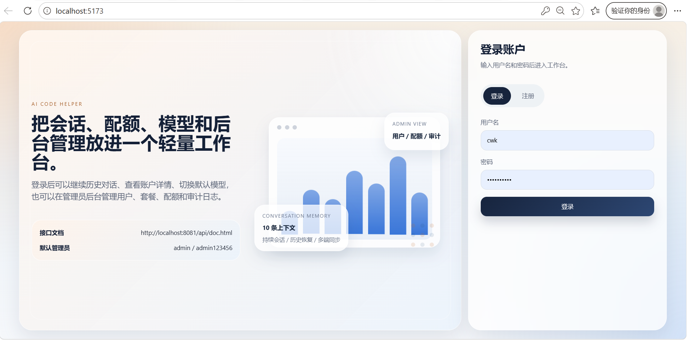
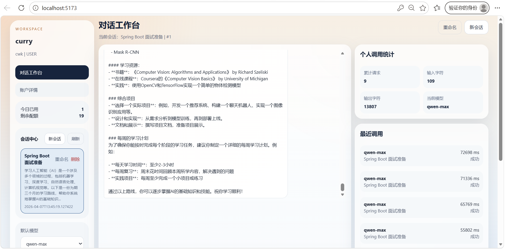
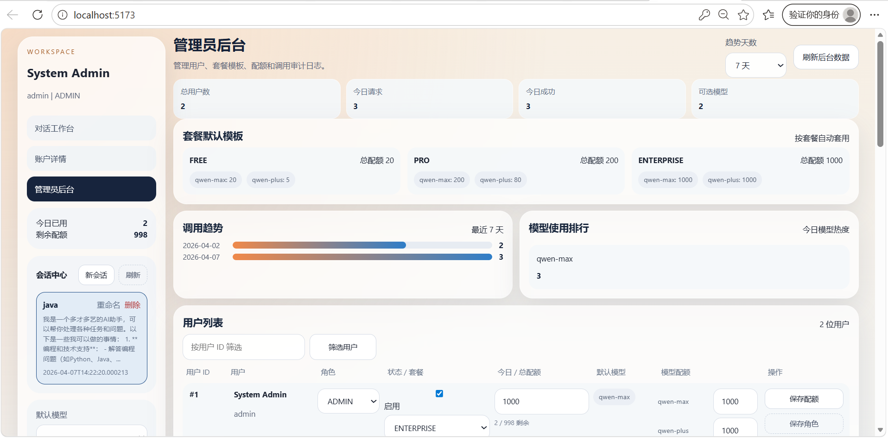

# AI Code Helper

一个面向编程学习、面试准备和 AI 问答场景的全栈项目。  
后端基于 Spring Boot 3 构建，集成 JWT 鉴权、MyBatis 数据访问、LangChain4j 框架、RAG 检索增强、会话中心、套餐与配额体系、调用审计日志和管理员后台能力；前端基于 Vue 3 + Vite 构建，提供登录注册、聊天工作台、账户详情和管理员界面。

后端部分的AI对话逻辑我主要参考项目原型（见最后项目原型的链接url），包含了核心的业务逻辑和功能实现；登录鉴权、用户管理、会话管理、配额控制、审计日志和管理员后台等功能后续在ai辅助下完成。

前端部分我全部通过AI生成，你可以在写好后端的基本框架后，用codex、cursor等工具生成前端代码，或者自己实现一个前端界面来调用后端接口。

如果你在复现本项目之后，想要完成一个属于自己的ai agent项目，可以在这个基础上继续迭代，增加更多功能和优化用户体验。
当然更推荐你从下面的参考原型开始，完成了基本的项目原型后，再自己通过AI工具进行功能迭代和优化，希望对各位有所帮助。

## 项目截图

登录页  


聊天工作台（普通用户）  


管理员后台  


## 核心功能

- 用户体系：注册、登录、JWT 鉴权、角色区分、禁用用户、账户详情页
- 会话中心：历史对话持久化、会话重命名、删除对话、删除消息、继续对话、多端同步
- AI 对话：SSE 流式输出、模型切换、消息编辑后重新生成
- 知识增强：基于 LangChain4j Easy RAG 的本地知识库检索增强
- 配额能力：每日总配额、按模型分配配额、套餐等级和默认配额模板
- 管理后台：用户列表、用户 ID 筛选、套餐与角色管理、配额管理、模型配额管理
- 调用审计：按用户、模型、成功失败、时间范围筛选调用日志
- 接口文档：集成 Knife4j / OpenAPI 3，便于联调和测试

## 软件架构

### 技术栈

**后端**

- Java 21
- Spring Boot 3.5
- Spring Web
- Spring Security
- MyBatis
- MySQL
- LangChain4j
- DashScope / 通义千问（需要申请API KEY）
- JWT
- Knife4j / OpenAPI 3
- Lombok

**前端**

- Vue 3
- TypeScript
- Vite
- Axios

### 核心特点

#### 1. 面向业务的 AI 应用后端

项目不仅提供大模型问答能力，还围绕 AI 场景补齐了用户体系、会话管理、配额控制、审计日志和后台管理接口，更接近可落地的业务系统。

#### 2. 流式对话与会话持久化结合

后端通过 SSE 增量返回模型输出，前端实时渲染；同时把会话、消息和上下文记忆写入数据库，保证刷新页面、重启服务后仍能继续对话。

#### 3. 基于 MyBatis 的显式数据访问

数据访问层统一采用 Mapper 模式，服务层通过 Mapper 执行 SQL，便于控制查询逻辑、审计统计 SQL 和复杂筛选场景。

#### 4. 可运营的用户与配额体系

项目支持禁用用户、套餐等级、默认配额模板、按模型配额限制和管理员后台配置，适合继续向多用户 AI 平台演进。

#### 5. 支持知识库增强与降级运行

已接入 RAG 检索增强。即使知识库初始化失败或嵌入模型额度不足，系统也可以降级启动，保证核心功能可用。

### 项目结构

```text
ai-code-helper/
├─ src/main/java/org/example/aicodehelper
│  ├─ config/         # Spring、OpenAPI、跨域、模型等配置
│  ├─ controller/     # Controller 层
│  ├─ domain/         # 实体对象
│  ├─ dto/request/    # 请求参数对象
│  ├─ event/          # SSE / 流式事件对象
│  ├─ exception/      # 全局异常处理
│  ├─ guardrail/      # 输入安全控制
│  ├─ listener/       # 模型调用监听
│  ├─ mapper/         # MyBatis Mapper 层
│  ├─ model/          # 大模型相关配置对象
│  ├─ rag/            # RAG 检索增强相关配置
│  ├─ security/       # JWT、用户认证与权限控制
│  ├─ service/        # Service 层
│  └─ vo/             # 返回前端的展示对象
├─ src/main/resources
│  ├─ application.yml # 应用配置
│  ├─ docs/           # 本地知识库文档
│  └─ system-prompt.txt
├─ ai-code-helper-frontend/vue
│  ├─ src/api/        # 前端请求封装
│  ├─ src/components/ # 页面组件
│  ├─ src/composables/# 组合式逻辑
│  └─ src/types/      # 前端类型定义
├─ image_show/        # README 截图资源
├─ sql/
│  └─ schema.sql      # 数据库初始化脚本
├─ pom.xml            # Maven 构建文件
└─ README.md
```

## 快速开始

### 前置要求

启动项目之前，请先准备以下环境：

- JDK 21
- Maven 3.9+
- Node.js 18+
- MySQL 8.x
- DashScope API Key

### 配置说明

后端默认读取 `src/main/resources/application.yml` 中的配置。当前项目支持通过环境变量覆盖关键项（推荐），也可以直接写在application.yml中（不推荐，使用此方法要注意将github仓库设置为私有）：

1.数据库配置
- `DB_URL`
- `DB_USERNAME`
- `DB_PASSWORD`

2.模型配置
- `DASHSCOPE_API_KEY`      # 模型调用API Key

3.安全配置，用于登录鉴权和 JWT 签名
- `APP_JWT_SECRET`

4.管理员账号配置（已配置默认账号）
- `APP_ADMIN_USERNAME`
- `APP_ADMIN_PASSWORD`

默认后端端口为 `8081`，上下文路径为 `/api`。

### 数据库初始化

首次启动前需要先手动初始化数据库结构。

#### 1. 创建数据库并导入表结构

数据库初始化脚本位于 [`sql/schema.sql`](sql/schema.sql)。

你可以任选一种方式执行：

**方式 A：在 MySQL 客户端中执行脚本**

```sql
SOURCE /path/to/ai-code-helper/sql/schema.sql;
```

**方式 B：使用命令行导入**

```bash
mysql -u root -p < sql/schema.sql
```

这个脚本会完成：

- 创建 `db1`
- 创建用户表、模型配额表、会话表、消息表、记忆表、调用审计表
- 建立必要的主键、唯一约束和外键关系

#### 2. 编码要求

数据库和数据表使用 `utf8mb4`，这样可以正常存储中文标题、消息内容和审计日志预览。

### 构建项目

#### 1. 构建后端

在项目根目录执行：

```bash
mvn clean package
```

如果只想跳过测试快速打包：

```bash
mvn -Dmaven.test.skip=true package
```

说明：如果你的本机 Maven 仓库里某些依赖文件权限异常，可能会导致打包失败。当前项目在这类情况下最常见的是本地 `rxjava` 依赖文件权限问题，而不是项目代码本身错误。

#### 2. 启动后端

```bash
mvn spring-boot:run
```

启动成功后可访问：

- Knife4j: `http://localhost:8081/api/doc.html`
- OpenAPI JSON: `http://localhost:8081/api/v3/api-docs`

#### 3. 安装并启动前端

进入前端目录：

```bash
cd ai-code-helper-frontend/vue
npm install
npm run dev
```

前端默认通过 Vite 开发服务器运行，并代理访问后端接口。  
启动后通常可访问：

- 前端页面：`http://localhost:5173`

### 默认管理员账号

若数据库中不存在管理员账号，系统启动时会按配置自动初始化管理员账户。默认值为：

- 用户名：`admin`
- 密码：`admin123456`

建议在实际使用前通过环境变量覆盖。

## 接口文档

项目已集成 Knife4j，启动成功后可直接访问接口文档：

- [http://localhost:8081/api/doc.html](http://localhost:8081/api/doc.html)

## SQL 调试

项目已开启 MyBatis SQL 控制台输出，运行和调试时可以直接看到：

- 执行的 SQL
- 绑定参数
- 返回列和结果行数

如果你希望进一步区分开发环境和生产环境，建议为 `application-dev.yml` 单独保留 SQL 日志配置。

## 后端设计亮点

### 1. 以业务能力为中心，而不是简单调用模型接口

后端不仅实现了大模型调用，还补齐了用户、会话、配额、审计和后台管理等完整业务闭环。

### 2. 会话中心具备可恢复上下文能力

系统把会话消息和上下文记忆一起持久化，保证“继续对话”是真正延续上下文，而不是只展示历史消息。

### 3. 数据访问层显式可控

采用 MyBatis Mapper 管理数据库访问，便于实现复杂筛选、统计查询和日志审计。

### 4. 支持模型和套餐扩展

模型目录、套餐等级、默认配额模板和模型配额都支持继续扩展，便于后续演进到多模型、多套餐的 AI 平台。

## 后续可扩展方向

- 补充单元测试和集成测试
- 增加知识库上传、管理和重建索引能力
- 增加会话搜索、分页、归档和导出能力
- 增加成本统计、限流和告警能力
- 支持更多模型供应商和多环境配置

## 参考原型

- [CSDN 参考文章](https://blog.csdn.net/weixin_41701290/article/details/149270103)

## License

如需开源发布，可在这里补充许可证说明，例如 MIT License。
